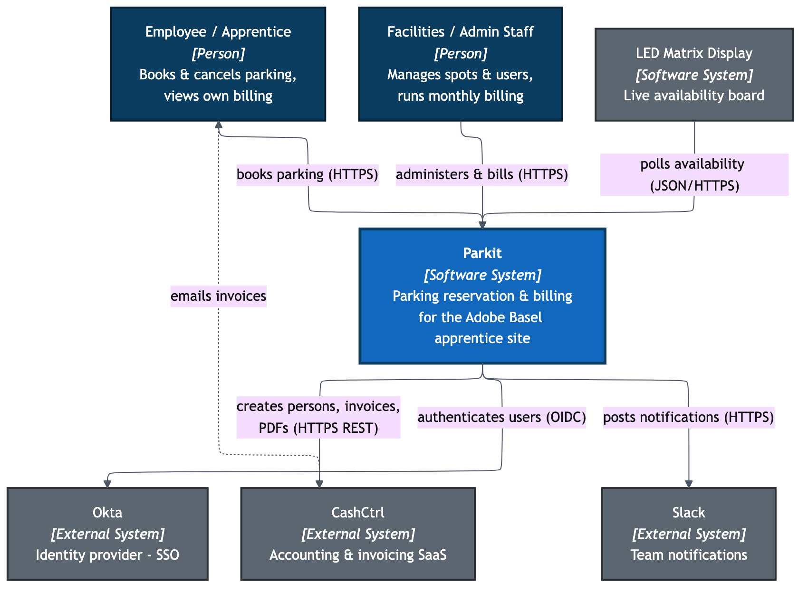
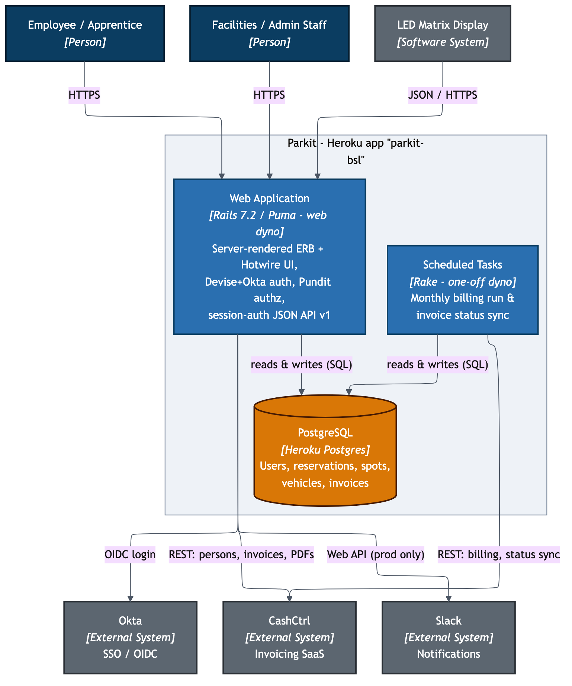
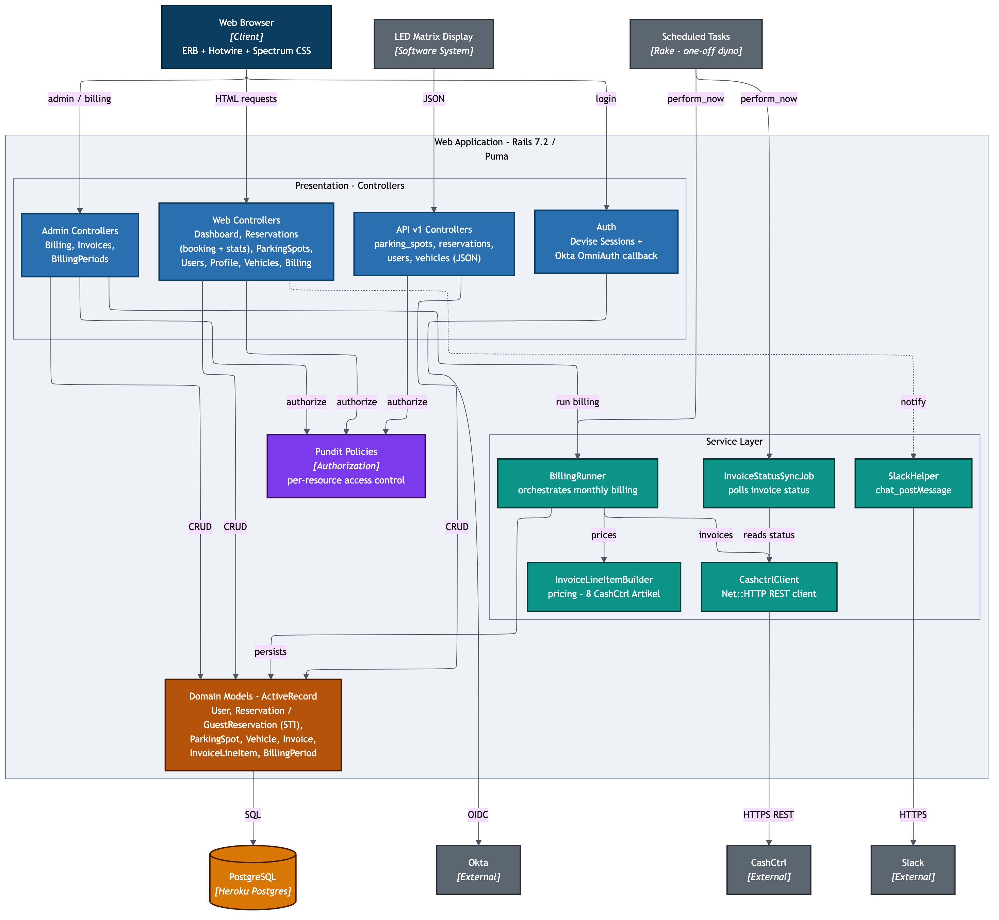

# Parkit - C4 Architecture

C4 model (Simon Brown) top three levels for the `parkit-service` app. Each level zooms in one step: **Context** (system in its environment) -> **Container** (deployable/runtime units) -> **Component** (building blocks inside the web app).

Sources are Mermaid (`.mmd`, ELK layout); PNG renders sit next to each. Regenerate with:

```bash
cd docs/architecture
for f in c4-01-context c4-02-container c4-03-component; do
  mmdc -i $f.mmd -o $f.png -b white -w 2200 -s 2
done
```

---

## Level 1 - System Context



Parkit is a parking reservation and billing app for the Adobe Basel apprentice site. Two human actors (booking employees/apprentices, and facilities/admin staff who manage spots, users and run monthly billing) plus a headless **LED matrix availability board** (the `led_matrix` user role, polling the JSON API). It delegates identity to **Okta** (OIDC SSO), pushes accounting to **CashCtrl** (which also emails invoices directly to customers), and posts operational notifications to **Slack**.

## Level 2 - Container



A single Heroku app (`parkit-bsl`). The **Web Application** is one Rails 7.2 / Puma `web` dyno serving server-rendered ERB + Hotwire and a session-authenticated JSON API v1 from the same process. **Scheduled Tasks** are rake invocations (`billing:run`, `billing:sync_status`) run in one-off dynos. Both share one **Heroku Postgres** database. There is no worker dyno and no durable queue.

## Level 3 - Component (Web Application)



Inside the web app: a controller tier (HTML web controllers, admin billing back-office, JSON API v1, and Devise/Okta auth) authorized uniformly through **Pundit policies**, a thin **service layer** (`BillingRunner` orchestrating `InvoiceLineItemBuilder` + `CashctrlClient`, plus `SlackHelper` and `InvoiceStatusSyncJob`), and **ActiveRecord domain models** persisting to Postgres. Billing runs synchronously in-request from the admin controllers; the scheduled tasks re-use the same `BillingRunner` / sync job via `perform_now`.

---

## External dependencies

| System | Protocol / Auth | Direction | Purpose |
|--------|-----------------|-----------|---------|
| Okta | OIDC via OmniAuth + Devise | Inbound login (browser -> Okta -> callback) | Sole authentication; users provisioned on first login |
| CashCtrl | HTTPS REST (JSON), HTTP Basic (API key) | Outbound | Persons, invoices ("orders"), invoice PDFs, account balances; also emails invoices to customers |
| Slack | HTTPS Web API (bot token) | Outbound | Admin notifications on reservation create/cancel (production only) |
| Heroku Postgres | TCP / `DATABASE_URL` | Outbound | Primary datastore (UUID PKs) |

## Runtime / deployment

| Aspect | Value |
|--------|-------|
| Platform | Heroku, app `parkit-bsl`, single `web` dyno |
| Runtime | Ruby 3.4.8, Rails 7.2.3, Puma (`WEB_CONCURRENCY` x `RAILS_MAX_THREADS`), `preload_app!` |
| Process model | `web` only (`Procfile`); no `worker`, no `release` phase |
| Background jobs | Active Job `:async` (in-process); only `InvoiceStatusSyncJob`, invoked via `perform_now` |
| CI/CD | GitHub Actions: rspec on PR/push; on `main`, git-push to Heroku + Platform API `db:migrate` + restart |

## Architectural notes / caveats

- **API v1 is not a separate container** - it is the same Rails process, session-cookie authenticated (no token auth). Modeled as components, not a container.
- **Action Cable is inert** - `cable.yml` names a Redis adapter in production, but there are no channels. No realtime feature; Redis is otherwise unused.
- **Stimulus is effectively unused** - only a stub controller; the booking grid is vanilla JS (`app/javascript/parking-spot-status/main.js`).
- **Active Storage uses `:local` disk in production** - ephemeral on Heroku; a durability gap if it holds anything that must persist.
- **Billing runs inline in the web request** (`BillingRunner` from `Admin::BillingController`) - no async offload; long runs occupy a Puma thread.
- **RuboCop is in the Gemfile but not run in CI.**
